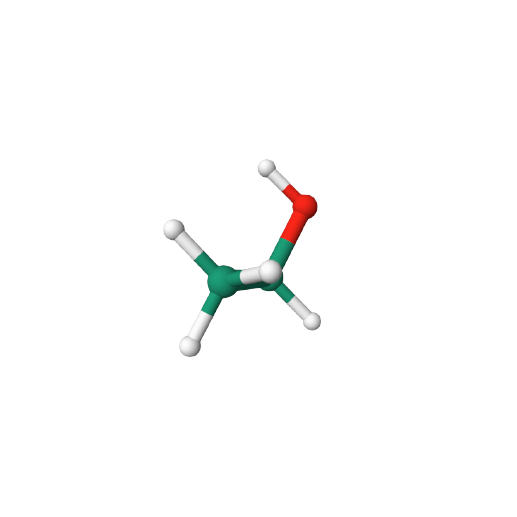
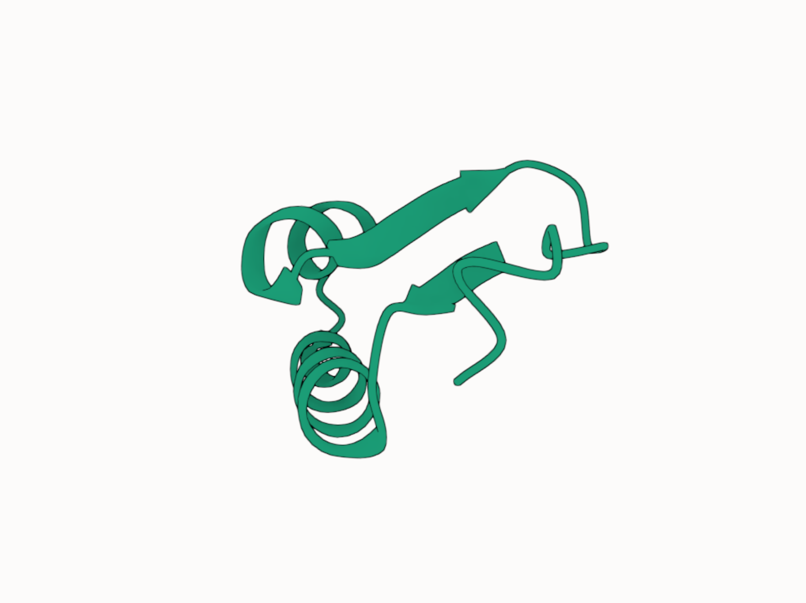

# Molfig

**Molfig** is a Typst package for rendering molecular structures in static documents.

It accepts PDB, mmCIF, BinaryCIF, and XYZ input. Version 0.2.0 renders SVG by default, or PNG on request, with a deterministic RGBA8 CPU renderer designed around the pinned [Mol*](https://molstar.org/) camera, material, lighting, and Quick Style state. Rendering no longer passes an OBJ, STL, or PLY mesh to Maquette.

## Quickstart

```typst
#import "@preview/molfig:0.2.0"

#let pdb = read("9R1O.pdb", encoding: none)

#molfig.render(
  pdb,
  format: "pdb",
  representation: "cartoon",
  assembly: "1",
  quality: "high",
  renderer: (
    viewport: (width: 1200, height: 900, pixel-ratio: 1),
    camera: (
      view: (name: "orbit", params: (azimuth: 35, elevation: 24)),
    ),
    background: (color: "#ffffff", transparent: true),
  ),
)
```

## XYZ

```typst
#import "@preview/molfig:0.2.0"

// PubChem CID 702, PubChem3D conformer 000002BE00000001.
#let xyz = read("ethanol.xyz", encoding: none)

#molfig.render(
  xyz,
  format: "xyz",
  representation: "default",
  color-theme: "element-symbol",
  quality: "high",
  renderer: (
    camera: (
      view: (name: "orbit", params: (azimuth: 125, elevation: 40)),
    ),
    background: (color: "#ffffff", transparent: true),
  ),
)
```



Coordinate source: PubChem CID [702](https://pubchem.ncbi.nlm.nih.gov/compound/702), conformer `000002BE00000001`.

## Illustrative style

Illustrative is independent of representation and color theme:

```typst
#molfig.render(
  read("1CRN.bcif", encoding: none),
  format: "bcif",
  representation: "cartoon",
  color-theme: "chain-id",
  style: "illustrative",
  output-format: "png",
  renderer: (
    viewport: (width: 1200, height: 900, pixel-ratio: 1),
    postprocessing: (
      occlusion: (name: "on"),
      outline: (name: "on"),
    ),
  ),
)
```



Illustrative resolves the pinned Mol* Quick Style defaults: unlit material color, SSAO, black depth outline, shadows off, and antialiasing on. An explicit `renderer.shading` or `renderer.postprocessing` value overrides the preset for any representation.

## Public API

- `render(data, ..., renderer: (:), output-format: "svg", width: auto, height: auto)` returns SVG or PNG image content.
- `render-result(data, ...)` additionally returns `image`, `output-format`, raw `pixels`, `pixel-width`, `pixel-height`, molecular `info`, and resolved `render-info`. Its `info.render_objects` is the compact list of actual grouped render objects and equals `render-info.render_objects`.
- `info(data, ...)` returns molecular and representation metadata without rasterization, including the detailed semantic `render_objects` list.
- `to-obj`, `to-mtl`, and `to-stl` are independent interchange exporters.
- `to-ply` remains available in the 0.2 series as a legacy exporter.

`render-object`, `mesh-info`, `mesh-format`, `config`, render-time `center`, and render-time `style-params` were removed in 0.2.0. `output-format` accepts only `"svg"` and `"png"`, with `"svg"` as the default. Because Mol* depth outlines, SSAO, transparency, and antialiasing are screen-space operations, SVG output is a lossless PNG raster embedded in an SVG container rather than vectorized molecular geometry.

The `renderer` dictionary has strict typed groups:

- `viewport`: `width`, `height`, `pixel-ratio`;
- `camera`: `mode`, `fov`, mapped `view`, `fog`, and `clipping`;
- `background`: hexadecimal `color` and `transparent`;
- `shading`: `ignore-light` and material values;
- `lighting`: exposure, ambient light, and directional lights;
- `transparency`: `mode` (currently `"wboit"`);
- `multi-sample`: `mode`, `sample-level`, and `reuse-occlusion`;
- `postprocessing`: mapped `occlusion`, `outline`, `shadow`, and `antialiasing`;
  occlusion also accepts Mol\*'s mapped `multi-scale` levels and thresholds.

Unknown renderer keys and unsupported passes are errors. Camera view parameters are variant-specific: `auto` takes no parameters, `orbit` accepts only `azimuth`, `elevation`, and `roll`, and `snapshot` requires `position`, `target`, `up`, `radius`, and `radius-max`. Camera clipping accepts Mol* snapshot values `far`, `min-near`, and `min-far`. Until their renderer paths are implemented value-for-value, `shading.material.bumpiness` must remain 0 and shadow must remain off. Pixel dimensions default to 800 × 800; `width` and `height` only control Typst layout size.

## Formats and representations

Use `format: "pdb"`, `"cif"`/`"mmcif"`, `"bcif"`, or `"xyz"`. Available representations include `"default"`, `"cartoon"`, `"polymer-cartoon"`, `"spacefill"`, `"ball-and-stick"`, `"surface"`, `"ribbon"`, and `"backbone"`.

`representation: "surface"` selects the Mol* Viewer Molecular Surface preset and is rasterized through the native indexed-mesh path. Standalone Gaussian volume and density/volume representations remain outside the 0.2 API; size-dependent ViewerAuto Gaussian surfaces are still constructed where the pinned preset selects them.

OBJ plus MTL is the preferred readable interchange output. Binary STL is useful for geometry-only downstream tools. PLY does not carry the themed material contract and receives no renderer-specific development.

## Documentation and examples

The full manual is [`package/docs/documentation.pdf`](package/docs/documentation.pdf), with source in [`package/docs/documentation.typ`](package/docs/documentation.typ). Complete sources and rendered results are under [`package/examples`](package/examples); data attribution is in [`package/examples/data/README.md`](package/examples/data/README.md).

## License and notices

Molfig is MIT licensed. It ports or adapts behavior from Mol*, which is also MIT licensed. See [`NOTICE.md`](NOTICE.md) and [`THIRD_PARTY_NOTICES.md`](THIRD_PARTY_NOTICES.md). Example PDB archive data and PubChem conformers retain their source terms and attribution listed with the data files.

## Development

```sh
cd wasm-plugin
cargo fmt --check
cargo test
cargo build --release --target wasm32-unknown-unknown
cp target/wasm32-unknown-unknown/release/molfig.wasm ../package/molfig.wasm
```
